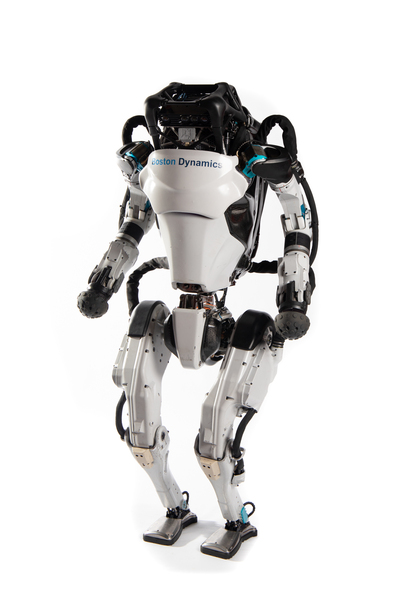

## Collection of Humanoid and Biped Robots

---------------------------------

### Asimo 
**Mass:** 48 [kg] ╏ **Nb actuators:** 57

References:

---------------------------------

### Atlas (old version)
**Mass:** 89 [kg] ╏ **Nb actuators:** 28 ╏ **Actuation:** Hydraulic ╏ **Height:** 1.5 [m]

References: https://bostondynamics.com/atlas/

---------------------------------

### Digit
**Mass:** 42.2 [kg] ╏ **Nb actuators:** 16 ╏ **Actuation:** Electric 

References:

### Cassie
**Mass:** 31 [kg] ╏ **Nb actuators:** 10 ╏ **Actuation:** Electric 

References:

### Leonardo
**Mass:** 2.5 [kg] ╏ **Nb actuators:** 10 (3 per leg, 4 motors with propellers) ╏ **Actuation:** Electric 

References: https://www.science.org/doi/10.1126/scirobotics.abf8136

### HRP-5P
**Mass:** 101 [kg] ╏ **Nb actuators:** 37

### Talos
**Mass:** 95 [kg] ╏ **Nb actuators:** 32

### Toro
**Mass:** 76 [kg] ╏ **Nb actuators:** 39

### Valkyrie
**Mass:** 129 [kg] ╏ **Nb actuators:** 44

### Optimus
**Mass:** 73 [kg] ╏ **Nb actuators:** 28

### Bruce
**Mass:** 3.5 [kg] ╏ **Nb actuators:** 10

### Bolt
**Mass:** 1.34 [kg] ╏ **Nb actuators:** 6

